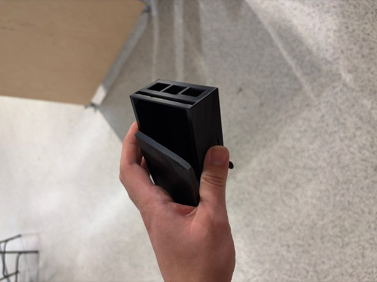

# Raspberry-Pi-5-Casing
CAD models and 3D printed a casing to protect a Raspbery Pi 5 intended to be on the end effector of the robotic arm for the Robots for Space Exploration rover. Done as design team work for Robots for Space Exploration.

**Highlights**
- **Acheived User Friendly Design:** Simple lid intuitive to access and remove the rapsberry pi.
- **Wiring Friendly:** All ports and wire connections have openings, even on the lid. Allows for no hinderance to use whilst protecting fragile components.
- **To be 3D printed:** Allows for protptyping and reiteration.
## 🔗 Project Resources
📟 [Raspberry Pi 5 Casing CAD Model Version 1](MIE243CheckIn2ASSEMBLY.zip)  

🥼 [Raspberry Pi 5 Print Version 1](MIE243CheckIn2ASSEMBLY.zip)  

---
## Results
**TBD**
- TBD
